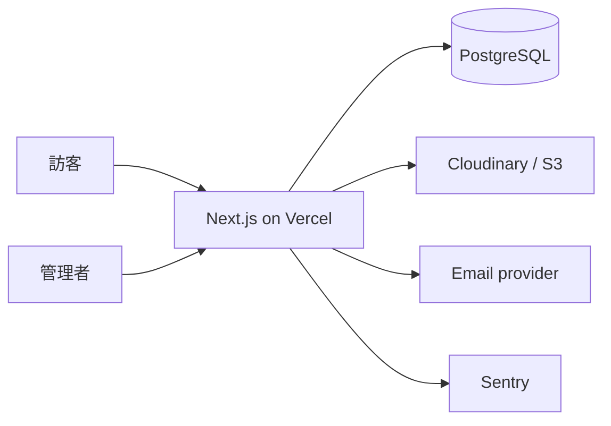

# 個人作品集網站：技術與系統架構規格

## 技術選型

| 層級 | 建議 | 原因 |
| --- | --- | --- |
| Web | Next.js 15 + TypeScript | SSR/SSG、SEO、同專案 API |
| UI | Tailwind CSS + shadcn/ui + Framer Motion | 一致元件與可控動畫 |
| 資料 | PostgreSQL + Prisma | 關聯資料與型別安全 migration |
| 身分 | Auth.js（magic link 或 Google） | 保護單一管理者後台 |
| 媒體 | Cloudinary 或 S3/R2 | 最佳化與直傳 |
| 表單 | Zod + React Hook Form | 共享 schema、良好體驗 |
| 維運 | Vercel、Sentry、GitHub Actions | 部署、監控、品質門檻 |

## 系統架構



公開頁面優先 Server Components 與快取；表單與後台是受控動態路由。媒體採瀏覽器取得簽名後直傳物件儲存。

## 檔案結構

```text
app/(site)/{page.tsx,work/,about/,services/,contact/}
app/admin/{page.tsx,work/,messages/}
app/api/{contact/route.ts,uploads/signature/route.ts,auth/[...nextauth]/route.ts}
app/{sitemap.ts,robots.ts,layout.tsx}
components/{ui/,site/,work/,admin/}
lib/{db.ts,auth.ts,validations.ts,rate-limit.ts,seo.ts}
prisma/{schema.prisma,seed.ts}
public/{images/,fonts/}
tests/{unit/,e2e/}
```

## 資料模型

```prisma
model Project {
  id String @id @default(cuid())
  slug String @unique
  title String
  excerpt String
  body Json
  coverImage String
  ogImage String?
  categories Category[]
  services Service[]
  isFeatured Boolean @default(false)
  publishedAt DateTime?
  createdAt DateTime @default(now())
  updatedAt DateTime @updatedAt
}
model Category { id String @id @default(cuid()); name String @unique; slug String @unique; projects Project[] }
model Service { id String @id @default(cuid()); name String @unique; slug String @unique; projects Project[] }
model ContactMessage { id String @id @default(cuid()); name String; email String; company String?; budget String?; projectType String?; message String; status String @default("new"); createdAt DateTime @default(now()) }
```

`body` 使用 Portable Text／JSON blocks；若長期由 Git 維護內容，改用 MDX 並移除內容寫入介面。

## API 規格

| 方法與路徑 | 權限 | 行為 |
| --- | --- | --- |
| `POST /api/contact` | 公開、限流 | 驗證、建立訊息、寄通知；回傳 `201 { id }` |
| `POST /api/uploads/signature` | 管理者 | 回傳限時上傳簽名與設定 |
| `GET /api/projects` | 公開 | 支援 `category`、`featured`、`page` 分頁 |
| `GET/PATCH/DELETE /api/admin/projects/:id` | 管理者 | 管理作品 |

錯誤格式為 `{ error: { code, message, fieldErrors? } }`。公開 API 只回傳已發佈作品；管理 API 驗證 session 與角色；聯絡表單依 IP + Email 限制 5 次／小時並驗證 Turnstile。

## 安全、測試與部署

`.env.example` 僅含鍵名：`DATABASE_URL`、`AUTH_SECRET`、`AUTH_GOOGLE_ID`、`AUTH_GOOGLE_SECRET`、`RESEND_API_KEY`、`CONTACT_TO_EMAIL`、`CLOUDINARY_*`、`TURNSTILE_*`、`SENTRY_DSN`。秘密只存在部署平台，絕不進版控或 client bundle。採 CSP、Secure HttpOnly SameSite cookie、輸入驗證與安全標頭。

- Vitest：schemas、工具、權限、速率限制。
- Testing Library：表單錯誤、鍵盤導覽、作品卡。
- Playwright：首頁、篩選、聯絡成功／失敗、未授權後台跳轉。
- GitHub Actions：format、lint、typecheck、test、`prisma validate`、production build。
- GitHub `main` 部署到 Vercel；PR 建 preview；migration 於受控步驟執行且先備份。

驗收：主要 E2E 綠燈、360–1440px 無溢位、Lighthouse 各項至少 90。
